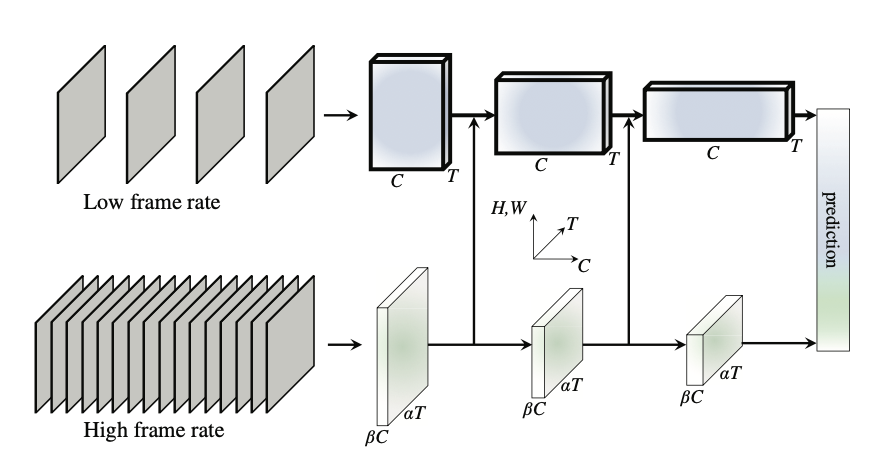

# SlowFast

A PyTorch implementation of SlowFast based on ICCV 2019 paper
[SlowFast Networks for Video Recognition](https://arxiv.org/abs/1812.03982).



## Requirements

- [Anaconda](https://www.anaconda.com/download/)
- [PyTorch](https://pytorch.org)

```
conda install pytorch=1.9.1 torchvision cudatoolkit -c pytorch
```

- [PyTorchVideo](https://pytorchvideo.org)

```
pip install pytorchvideo
```

## Dataset

[kinetics-400](https://github.com/cvdfoundation/kinetics-dataset) dataset is used in this repo, you could download these
datasets from official websites. The data directory structure is shown as follows:

 ```
├──data
   ├── train
       ├── abseiling
           ├── _4YTwq0-73Y_000044_000054.mp4
           └── ...
           ...
       ├── archery
           same structure as abseiling
   ├── test
      same structure as train
      ...
```

## Usage

### Train Model

```
python train.py --batch_size 16
optional arguments:
--data_root                   Datasets root path [default value is 'data']
--batch_size                  Number of videos in each mini-batch [default value is 8]
--epochs                      Number of epochs over the model to train [default value is 10]
--save_root                   Result saved root path [default value is 'result']
```

### Test Model

```
python test.py --video_path data/test/beatboxing/5s_gFWie1Ys_000069_000079.mp4
optional arguments:
--model_path                  Model path [default value is 'result/slow_fast.pth']
--video_path                  Video path [default value is 'data/test/applauding/_V-dzjftmCQ_000023_000033.mp4']
```
